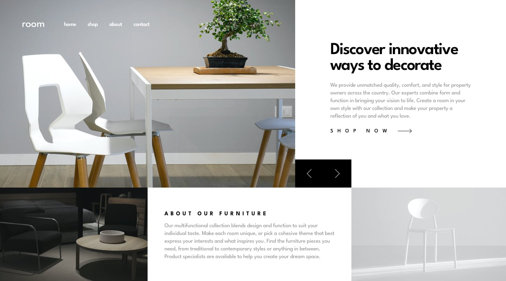
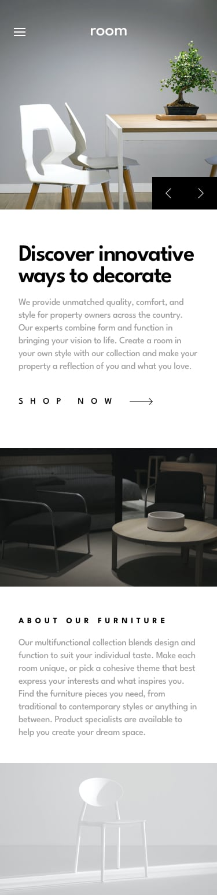

# Frontend Mentor - Room homepage

This is a solution to the [Room homepage challenge on Frontend Mentor](https://www.frontendmentor.io/challenges/room-homepage-BtdBY_ENq).

## Table of contents

- [Overview](#overview)
  - [Screenshot](#screenshot)
  - [Links](#links)
- [My process](#my-process)
  - [Built with](#built-with)
  - [What I learned](#what-i-learned)
  - [Continued development](#continued-development)
- [Author](#author)

---

## Overview

### Screenshot

|  |  |
| :--: | :--: |
| Desktop | Mobile |

### Links

- Solution URL: [Add solution URL here](https://your-solution-url.com)
- Live Site URL: [GitHub Pages](https://rahulpaul127.github.io/room-homepage-master/)

---

## My process

### Built with

- Semantic HTML5 markup
- CSS custom properties (design tokens)
- CSS Flexbox layout system
- Mobile-first responsive workflow
- Vanilla JavaScript (Slider and Navigation Logic)
- HTML `<picture>` element for responsive art direction

### What I learned

- **Responsive Art Direction**: Using the HTML `<picture>` and `<source>` elements to seamlessly swap out the hero images depending on the viewport width (`media="(min-width: 1024px)"`). This is much cleaner and more performant than hiding/showing images with CSS.
- **Vanilla JavaScript Carousel**: Building a state-based slider that manages not just the hero image, but also the corresponding text (H1 and paragraph). Using a shared data array to update the DOM elements, accompanied by a subtle CSS opacity transition for a smooth UX.
- **Complex Mobile Navigation**: Creating a mobile overlay menu where the links are displayed inline horizontally instead of vertically. Implementing scroll locking (`document.body.style.overflow = 'hidden'`) when the overlay is active to improve the mobile experience.
- **CSS Layout Problem Solving**: Resolving tricky z-index and click-interception issues. I learned how to use `pointer-events: none` on an absolutely positioned Hamburger menu icon to disable it while the menu is open, allowing clicks to safely pass through to the `Close` button situated directly beneath it.
- **Perfect Flexbox Centering**: By utilizing `position: absolute` on the hamburger toggle, I removed it from the normal flex document flow. This allowed the central "room" logo to mathematically center itself perfectly in the remaining viewport using `margin: 0 auto`, exactly matching the design file.

### Continued development

- Add deployed links after publishing the project to GitHub Pages.
- Implement **Keyboard Navigation** for the slider component so users can use the Left and Right arrow keys to navigate the content.
- Explore adding **Touch/Swipe support** on mobile devices to allow users to intuitively swipe left or right to change the hero slides.

## Author

- Frontend Mentor - [@rahulpaul12](https://www.frontendmentor.io/profile/rahulpaul12)
- Twitter - [@rahulpaul127](https://x.com/rahulpaul127)
